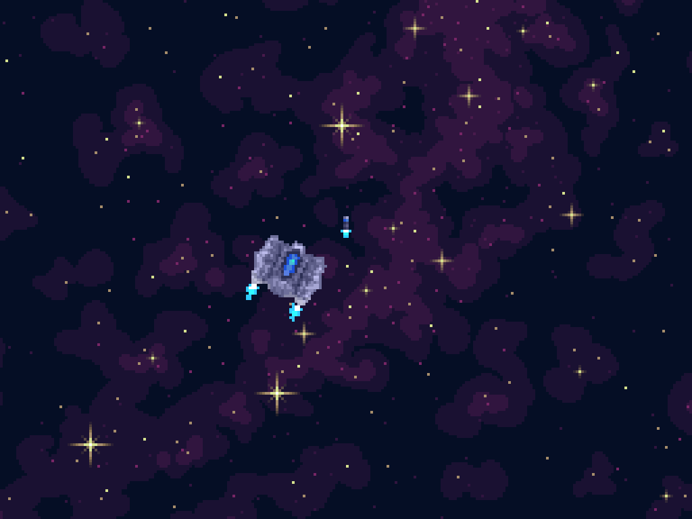

# Reaction Control
> Space shoot-em-up game written in go with ebiten game engine!

## About this project
This project is to be a resume oriented space action game demonstrating my programming abilities. The goal is to create a space shoot-em-up with full a newtonian physics simulation and control scheme rooted in real science! In real life many spacecraft have small thrusters oriented in different locations that are used to control attitude and velocity. These thrusters along with a variety of other devices belong to the craft's [reaction control system](https://en.wikipedia.org/wiki/Reaction_control_system) or *RCS*. Thus, the name of the game is Reaction Control.
